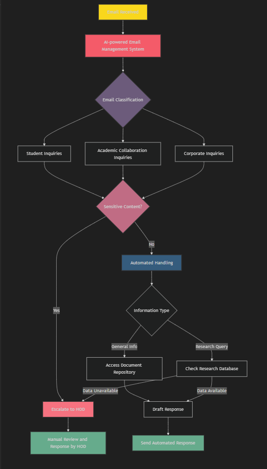

# Email Classification for University HODs

## Student Information
- **Name:** ANKIT YADAV
- **Qualification :** MTech ( CSE ) with research focus on NLP

## Project Overview
This project implements an AI-powered Email Management System for Head of Departments (HODs) at a university. The system classifies incoming emails into different categories and handles them accordingly, streamlining the email management process.

## Model Selection and Approach

### Models Implemented
1. Fine-tuned Pretrained Model: bert-base-uncased
2. Custom Neural Network:

### Rationale for Model Selection

## Fine-tuning Details
- **Pretrained Model:** 
- **Custom Neural Network:** 

## Project Flowchart

## Model Performance

### Fine-tuned Pretrained Model
- Accuracy: [X%]
- Precision: [X%]
- Recall: [X%]
- F1 Score: [X]

### Custom Neural Network
- Accuracy: [Y%]
- Precision: [Y%]
- Recall: [Y%]
- F1 Score: [Y]

## Dataset Information

